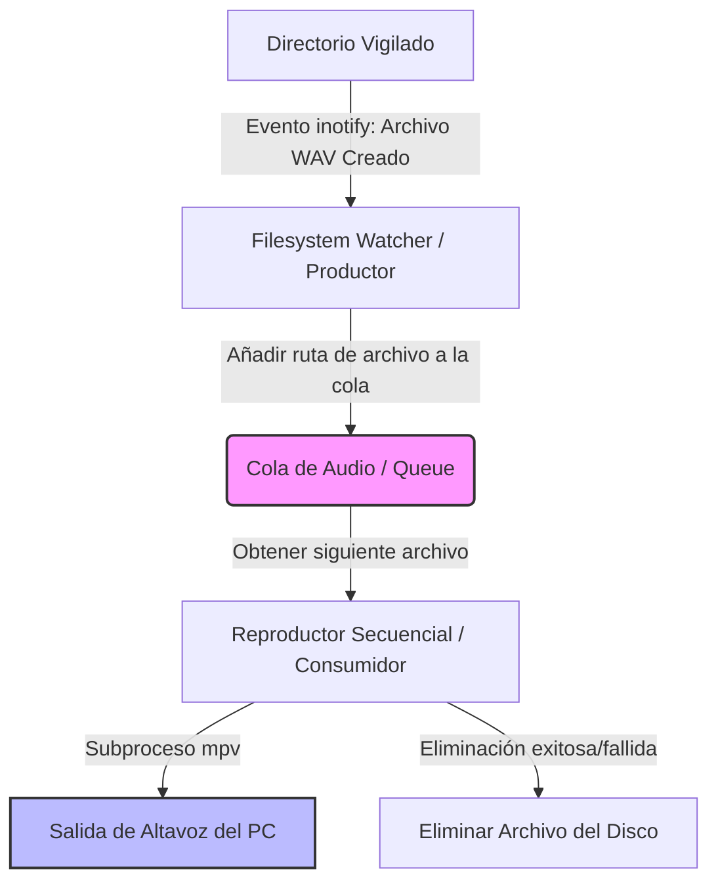

# speaker-watchdog 🐕🔊

**speaker-watchdog** es un servicio local ligero implementado en **Python** para entornos **Linux**. Su propósito es monitorizar de forma reactiva un directorio del sistema en busca de nuevos archivos de audio en formato `.wav`. Cuando detecta un nuevo archivo, lo añade a una cola secuencial para reproducirlo a través de los altavoces del PC utilizando la utilidad del sistema `mpv`, y procede a eliminarlo de inmediato una vez finalizada la reproducción.

Este servicio está diseñado bajo principios de robustez, eficiencia y facilidad de mantenimiento, integrándose perfectamente en el sistema mediante **systemd**.

---

## 📋 Tabla de contenidos

1. [Descripción y Propósito](#-descripción-y-propósito)
2. [Solución Técnica Planteada](#-solución-técnica-planteada)
3. [Arquitectura del Servicio](#-arquitectura-del-servicio)
4. [Requisitos del Sistema](#-requisitos-del-sistema)
5. [Instalación y Configuración](#-instalación-y-configuración)
6. [Estructura del Proyecto](#-estructura-del-proyecto)
7. [Buenas Prácticas Implementadas](#-buenas-prácticas-implementadas)
8. [Desarrollo y Contribución](#-desarrollo-y-contribución)

---

## 📖 Descripción y Propósito

En entornos de automatización local, notificaciones del sistema o laboratorios de desarrollo, a menudo surge la necesidad de emitir avisos sonoros instantáneos cuando finaliza una tarea de larga duración, cuando ocurre una alerta del sistema o cuando otro microservicio genera un reporte de audio.

`speaker-watchdog` actúa como un **demonio pasivo (daemon)** de audio:
*   **Vigila silenciosamente** una carpeta configurada.
*   **Reacciona instantáneamente** ante la llegada de nuevos archivos `.wav`.
*   **Evita solapamientos sonoros** reproduciendo las alertas de forma ordenada y secuencial.
*   **Mantiene el disco limpio** eliminando el archivo procesado automáticamente tras su reproducción.

---

## 🛠️ Solución Técnica Planteada

Para asegurar la máxima robustez y un consumo mínimo de recursos, se ha optado por la siguiente combinación tecnológica y de diseño:

1.  **Monitoreo Reactivo (Event-Driven):** En lugar de realizar un sondeo constante de disco (polling con `os.listdir`), que consume CPU y provoca retrasos en la respuesta, utilizamos la librería `watchdog` de Python. Esta librería aprovecha la API nativa `inotify` del kernel de Linux, recibiendo eventos instantáneos enviados por el sistema de archivos cuando el archivo `.wav` se ha escrito por completo (`IN_CLOSE_WRITE`).
2.  **Reproducción de Audio:** Delegamos la reproducción en `mpv`, una utilidad CLI altamente optimizada, ligera y estándar en sistemas Linux. Se ejecuta de manera aislada y silenciosa sin cargar interfaz gráfica (`mpv --no-video --quiet`).
3.  **Cola de Reproducción Secuencial (Thread-safe Queue):** Si múltiples procesos depositan archivos `.wav` al mismo tiempo en la carpeta monitorizada, reproducirlos en paralelo daría como resultado un caos de audio ininteligible. Implementamos un patrón **Productor-Consumidor**:
    *   El **Productor** (el watcher de `watchdog`) detecta el archivo y lo mete en una `queue.Queue`.
    *   El **Consumidor** (un hilo de ejecución dedicado y en segundo plano) saca los archivos de la cola de uno en uno, los reproduce ordenadamente y los elimina tras finalizar cada pista.
4.  **Configuración mediante Entorno:** El directorio vigilado y otros parámetros del servicio se configuran de manera flexible mediante variables de entorno (como `WATCHDOG_DIR`), permitiendo su fácil parametrización sin alterar el código base.

---

## 🏗️ Arquitectura del Servicio

La arquitectura del servicio se compone de tres módulos lógicos principales que operan de forma asíncrona y coordinada:



### Componentes de Software:
*   **`WatcherService` (Productor):** Escucha y filtra eventos del sistema de archivos. Ignora archivos temporales y procesa únicamente archivos con extensión `.wav`.
*   **`AudioQueue` (Canal de Comunicación):** Una cola en memoria FIFO (*First-In, First-Out*) thread-safe que almacena las rutas de los archivos de audio pendientes de reproducir.
*   **`AudioPlayerWorker` (Consumidor):** Hilo de fondo en bucle infinito bloqueante que espera nuevos elementos en la cola. Ejecuta la llamada externa a `mpv` y maneja la eliminación posterior del fichero garantizando tolerancia a fallos.

---

## 🖥️ Requisitos del Sistema

*   **Sistema Operativo:** GNU/Linux (Ubuntu, Debian, Fedora, Arch Linux, etc.).
*   **Python:** Versión `3.8` o superior.
*   **Reproductor de Audio CLI:** `mpv` instalado en el sistema (`sudo apt install mpv` o equivalente).
*   **Servidor de Sonido Activo:** PulseAudio o PipeWire (estándar en distros Linux modernas).

---

## 🚀 Instalación y Configuración

### 1. Clonar el repositorio y configurar el directorio de trabajo
```bash
git clone https://github.com/danuser2018/speaker-watchdog.git
cd speaker-watchdog
```

### 2. Crear y activar el entorno virtual de Python
Es altamente recomendable el uso de entornos virtuales para aislar las dependencias del proyecto:
```bash
python3 -m venv venv
source venv/bin/activate
```

### 3. Instalar dependencias necesarias
```bash
pip install --upgrade pip
pip install -r requirements.txt
```
*(Nota: El archivo `requirements.txt` incluye la dependencia de `watchdog` y `python-dotenv` para facilitar la configuración local).*

### 4. Archivo de Configuración de Entorno (`.env`)
Crea un archivo `.env` en la raíz del proyecto para definir la ruta que deseas vigilar:
```bash
cp .env.example .env
```
Edita `.env` con la ruta deseada:
```env
# Directorio del sistema a monitorizar
WATCHDOG_DIR=/home/usuario/alertas_audio

# Nivel de log para el servicio (DEBUG, INFO, WARNING, ERROR)
LOG_LEVEL=INFO
```

> [!IMPORTANT]
> Asegúrate de que el directorio configurado en `WATCHDOG_DIR` existe y el usuario que ejecutará el servicio tiene permisos de lectura y escritura (para poder eliminar los archivos tras reproducirlos).

---

## ⚙️ Configuración como Servicio de Systemd

En entornos Linux modernos, el servidor de sonido (PulseAudio o PipeWire) se ejecuta **como un proceso de usuario** independiente. Si ejecutamos `speaker-watchdog` como un servicio del sistema general (`/etc/systemd/system` ejecutado por `root` o el usuario `systemd-network`), este no tendrá los permisos ni variables de entorno necesarias para acceder al servidor de audio del usuario actual.

Por ello, la **mejor práctica** absoluta para servicios de audio es instalarlos como **Servicios de Usuario de Systemd** (`systemd --user`).

### Instrucciones de Despliegue:

1.  **Crear el directorio de servicios de usuario** (si no existe):
    ```bash
    mkdir -p ~/.config/systemd/user/
    ```

2.  **Crear el archivo del servicio:**
    Crea el fichero `~/.config/systemd/user/speaker-watchdog.service` con la siguiente estructura (reemplaza las rutas absolutas por las tuyas):

    ```ini
    [Unit]
    Description=Speaker Watchdog Service (Audio alert playback queue)
    After=default.target sound.target

    [Service]
    Type=simple
    WorkingDirectory=/home/danuser2018/workspace/speaker-watchdog
    ExecStart=/home/danuser2018/workspace/speaker-watchdog/venv/bin/python src/main.py
    Restart=always
    RestartSec=3
    # Cargamos las variables de entorno
    EnvironmentFile=/home/danuser2018/workspace/speaker-watchdog/.env
    # Forzar uso del entorno gráfico/sesión DBUS para PulseAudio/PipeWire si fuera necesario
    Environment=XDG_RUNTIME_DIR=/run/user/1000

    [Install]
    WantedBy=default.target
    ```

3.  **Recargar y habilitar el servicio:**
    ```bash
    # Recargar el daemon de systemd para el espacio de usuario
    systemctl --user daemon-reload

    # Habilitar el servicio para que inicie automáticamente al arrancar el PC
    systemctl --user enable speaker-watchdog.service

    # Iniciar el servicio inmediatamente
    systemctl --user start speaker-watchdog.service
    ```

4.  **Verificar el estado del servicio y logs:**
    ```bash
    # Comprobar si está activo y en ejecución
    systemctl --user status speaker-watchdog.service

    # Consultar los logs en tiempo real
    journalctl --user -u speaker-watchdog.service -f
    ```

---

## 📂 Estructura del Proyecto

El proyecto sigue una estructura limpia, modular y mantenible basada en buenas prácticas de desarrollo de software:

```text
speaker-watchdog/
├── .env.example          # Plantilla para las variables de entorno
├── .gitignore            # Exclusiones de Git (venv, logs, .env)
├── CHANGELOG.md          # Registro histórico detallado de cambios (en español)
├── CONTRIBUTING.md       # Guía de contribución y flujo de desarrollo
├── LICENSE               # Licencia del proyecto
├── README.md             # Este archivo informativo
├── requirements.txt      # Dependencias del proyecto
├── src/                  # Código fuente de la aplicación
│   ├── __init__.py
│   ├── main.py           # Punto de entrada de la aplicación
│   ├── config.py         # Carga y validación de variables de entorno
│   ├── watcher.py        # Módulo de monitorización de archivos
│   └── player.py         # Módulo reproductor y gestor de cola
└── tests/                # Pruebas unitarias y de integración
    ├── __init__.py
    ├── test_watcher.py
    └── test_player.py
```

---

## 🌟 Buenas Prácticas Implementadas

*   **Tratamiento de Archivos Parciales:** En sistemas Linux, un archivo grande puede tardar unos milisegundos en escribirse del todo en disco. Para evitar que el reproductor intente reproducir un archivo incompleto y de error, el servicio espera a que se cierre el descriptor de escritura (`IN_CLOSE_WRITE`) antes de procesarlo.
*   **Manejo de Errores Defensivo:** Si un archivo `.wav` está corrupto, no es de audio o `mpv` falla al reproducirlo, el servicio captura la excepción, registra el error detalladamente en el `journal` de systemd, y procede a **eliminar el archivo corrupto** para que no se quede atascado ni vuelva a procesarse repetidamente.
*   **Estructura FIFO Limpia:** Las operaciones de lectura/escritura en disco no bloquean el flujo de detección de nuevos archivos. La detección ocurre en el hilo principal y la reproducción se realiza en un hilo consumidor separado, lo que garantiza que nunca se pierda un evento de inotify.
*   **Trazabilidad y Observabilidad:** El servicio utiliza el framework nativo `logging` de Python mapeando de forma transparente los niveles `INFO`, `DEBUG` y `ERROR` al `sys.stdout` y `sys.stderr`, integrándose nativamente con los logs estructurados de `journald` de systemd.

---

## 🤝 Desarrollo y Contribución

Si deseas contribuir al desarrollo del proyecto, por favor lee detalladamente nuestra [Guía de Contribución (CONTRIBUTING.md)](CONTRIBUTING.md) para conocer las pautas de estilo de código, el modelo de ramificación **Trunk Based Development**, y el estándar de **Conventional Commits** que seguimos con rigurosidad.
